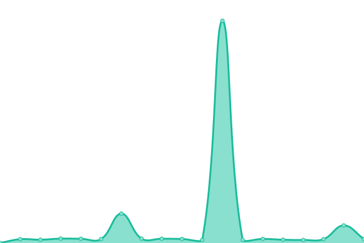

# [📈 Live Status](https://demo.upptime.js.org): <!--live status--> **🟧 Partial outage**

This repository contains the open-source uptime monitor and status page for [DimenSpace](https://demo.upptime.js.org), powered by [Upptime](https://github.com/upptime/upptime).

With [Upptime](https://upptime.js.org), you can get your own unlimited and free uptime monitor and status page, powered entirely by a GitHub repository. We use [Issues](https://github.com/dimenspace/aosp-uptime/issues) as incident reports, [Actions](https://github.com/dimenspace/aosp-uptime/actions) as uptime monitors, and [Pages](https://demo.upptime.js.org) for the status page.

<!--start: status pages-->
<!-- This summary is generated by Upptime (https://github.com/upptime/upptime) -->
<!-- Do not edit this manually, your changes will be overwritten -->
<!-- prettier-ignore -->
| URL | Status | History | Response Time | Uptime |
| --- | ------ | ------- | ------------- | ------ |
|  [android-14.0.0_r2](http://aospxref.com/android-14.0.0_r2/) | 🟥 Down | [android-14-0-0-r2.yml](https://github.com/dimenspace/aosp-uptime/commits/HEAD/history/android-14-0-0-r2.yml) | 

 5063ms
     
 | 

<a href="https://status.aospxref.com/history/android-14-0-0-r2">98.33%</a>
    

|  [android-13.0.0_r3](http://aospxref.com/android-13.0.0_r3/) | 🟥 Down | [android-13-0-0-r3.yml](https://github.com/dimenspace/aosp-uptime/commits/HEAD/history/android-13-0-0-r3.yml) | 

 2931ms
     
 | 

<a href="https://status.aospxref.com/history/android-13-0-0-r3">98.90%</a>
    

|  [android-12.0.0_r3](http://aospxref.com/android-12.0.0_r3/) | 🟩 Up | [android-12-0-0-r3.yml](https://github.com/dimenspace/aosp-uptime/commits/HEAD/history/android-12-0-0-r3.yml) | 

 2115ms
     
 | 

<a href="https://status.aospxref.com/history/android-12-0-0-r3">99.16%</a>
    

|  [android-11.0.0_r21](http://aospxref.com/android-11.0.0_r21/) | 🟩 Up | [android-11-0-0-r21.yml](https://github.com/dimenspace/aosp-uptime/commits/HEAD/history/android-11-0-0-r21.yml) | 

 1129ms
     
 | 

<a href="https://status.aospxref.com/history/android-11-0-0-r21">99.00%</a>
    

|  [android-10.0.0_r47](http://aospxref.com/android-10.0.0_r47/) | 🟩 Up | [android-10-0-0-r47.yml](https://github.com/dimenspace/aosp-uptime/commits/HEAD/history/android-10-0-0-r47.yml) | 

 1204ms
     
 | 

<a href="https://status.aospxref.com/history/android-10-0-0-r47">98.83%</a>
    

|  [android-9.0.0_r61](http://aospxref.com/android-9.0.0_r61/) | 🟥 Down | [android-9-0-0-r61.yml](https://github.com/dimenspace/aosp-uptime/commits/HEAD/history/android-9-0-0-r61.yml) | 

 1878ms
     
 | 

<a href="https://status.aospxref.com/history/android-9-0-0-r61">98.47%</a>
    

|  [android-8.1.0_r81](http://aospxref.com/android-8.1.0_r81/) | 🟥 Down | [android-8-1-0-r81.yml](https://github.com/dimenspace/aosp-uptime/commits/HEAD/history/android-8-1-0-r81.yml) | 

 370ms
     
 | 

<a href="https://status.aospxref.com/history/android-8-1-0-r81">99.37%</a>
    

|  [android-7.1.2_r39](http://aospxref.com/android-7.1.2_r39/) | 🟥 Down | [android-7-1-2-r39.yml](https://github.com/dimenspace/aosp-uptime/commits/HEAD/history/android-7-1-2-r39.yml) | 

 290ms
     
 | 

<a href="https://status.aospxref.com/history/android-7-1-2-r39">98.76%</a>
    

|  [android-7.0.0_r7](http://aospxref.com/android-7.0.0_r7/) | 🟥 Down | [android-7-0-0-r7.yml](https://github.com/dimenspace/aosp-uptime/commits/HEAD/history/android-7-0-0-r7.yml) | 

 2812ms
     
 | 

<a href="https://status.aospxref.com/history/android-7-0-0-r7">99.21%</a>
    

|  [android-6.0.1_r9](http://aospxref.com/android-6.0.1_r9/) | 🟥 Down | [android-6-0-1-r9.yml](https://github.com/dimenspace/aosp-uptime/commits/HEAD/history/android-6-0-1-r9.yml) | 

 414ms
     
 | 

<a href="https://status.aospxref.com/history/android-6-0-1-r9">99.16%</a>
    

|  [android-5.1.1_r9](http://aospxref.com/android-5.1.1_r9/) | 🟥 Down | [android-5-1-1-r9.yml](https://github.com/dimenspace/aosp-uptime/commits/HEAD/history/android-5-1-1-r9.yml) | 

 803ms
     
 | 

<a href="https://status.aospxref.com/history/android-5-1-1-r9">98.77%</a>
    

|  [android-5.0.2_r3](http://aospxref.com/android-5.0.2_r3/) | 🟩 Up | [android-5-0-2-r3.yml](https://github.com/dimenspace/aosp-uptime/commits/HEAD/history/android-5-0-2-r3.yml) | 

 1498ms
     
 | 

<a href="https://status.aospxref.com/history/android-5-0-2-r3">98.97%</a>
    

|  [android-5.0.2_r3](http://aospxref.com/android-5.0.2_r3/) | 🟩 Up | [android-5-0-2-r3.yml](https://github.com/dimenspace/aosp-uptime/commits/HEAD/history/android-5-0-2-r3.yml) | 

 1498ms
     
 | 

<a href="https://status.aospxref.com/history/android-5-0-2-r3">98.97%</a>
    

|  [kernel-android14-6.1-lts](http://aospxref.com/kernel-android14-6.1-lts/) | 🟥 Down | [kernel-android14-6-1-lts.yml](https://github.com/dimenspace/aosp-uptime/commits/HEAD/history/kernel-android14-6-1-lts.yml) | 

 270ms
     
 | 

<a href="https://status.aospxref.com/history/kernel-android14-6-1-lts">99.27%</a>
    

|  [kernel-android14-5.15-lts](http://aospxref.com/kernel-android14-5.15-lts/) | 🟥 Down | [kernel-android14-5-15-lts.yml](https://github.com/dimenspace/aosp-uptime/commits/HEAD/history/kernel-android14-5-15-lts.yml) | 

 343ms
     
 | 

<a href="https://status.aospxref.com/history/kernel-android14-5-15-lts">98.69%</a>
    

|  [kernel-android13-5.15-lts](http://aospxref.com/kernel-android13-5.15-lts/) | 🟥 Down | [kernel-android13-5-15-lts.yml](https://github.com/dimenspace/aosp-uptime/commits/HEAD/history/kernel-android13-5-15-lts.yml) | 

 272ms
     
 | 

<a href="https://status.aospxref.com/history/kernel-android13-5-15-lts">99.36%</a>
    

|  [kernel-android13-5.10-lts](http://aospxref.com/kernel-android13-5.10-lts/) | 🟥 Down | [kernel-android13-5-10-lts.yml](https://github.com/dimenspace/aosp-uptime/commits/HEAD/history/kernel-android13-5-10-lts.yml) | 

 1104ms
     
 | 

<a href="https://status.aospxref.com/history/kernel-android13-5-10-lts">98.48%</a>
    

|  [kernel-android12-5.10-lts](http://aospxref.com/kernel-android12-5.10-lts/) | 🟥 Down | [kernel-android12-5-10-lts.yml](https://github.com/dimenspace/aosp-uptime/commits/HEAD/history/kernel-android12-5-10-lts.yml) | 

 2078ms
     
 | 

<a href="https://status.aospxref.com/history/kernel-android12-5-10-lts">98.91%</a>
    

<!--end: status pages-->

[**Visit our status website →**](https://demo.upptime.js.org)

## 📄 License

- Powered by: [Upptime](https://github.com/upptime/upptime)
- Code: [MIT](./LICENSE) © [DimenSpace](https://demo.upptime.js.org)
- Data in the `./history` directory: [Open Database License](https://opendatacommons.org/licenses/odbl/1-0/)
